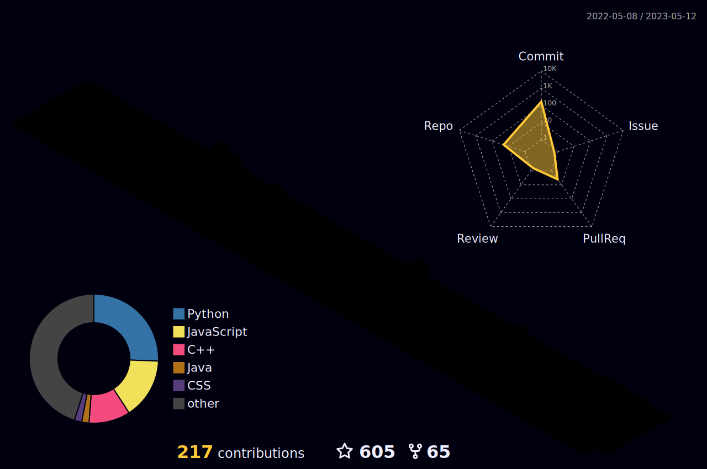

 <!--  
 Building DE Community 
 -->
  <!-- <h4 align="center"> 
</h4>
-->

 <!-- Comments 

 -->

### :pushpin: Hi, I'm Artemii. I'm experienced in interpreting and analyzing data to drive growth for a banks, finance, retail companies. Furnish insights, analytics, and business intelligence needed to guide decisions.
Currently I'm Data Engineeer in Bank. 

 
<h2>Skills </h2>
<h3>SQL, Python, Hadoop, Impala, Airflow, SuperSet, SAS MA </h3>

  

  

## Contact Me

[![LinkedIn][1.2]][1] [![Telegram][2.2]][2] [![Gmail][3.2]][3] [![Reddit][4.2]][4]

[1.2]: https://github.com/ArtieFalcon/ArtieFalcon/blob/main/assets/linkedin.png
[2.2]: https://github.com/ArtieFalcon/ArtieFalcon/blob/main/assets/telegram1.png
[3.2]: https://github.com/ArtieFalcon/ArtieFalcon/blob/main/assets/gmail.png
[4.2]: https://github.com/ArtieFalcon/ArtieFalcon/blob/main/assets/reddit.png

[1]: https://www.linkedin.com/in/artemiy-s-708111210
[2]: https://telegram.me/xxxagtx
[3]: mailto:sokolartemy@gmail.com
[4]: https://www.reddit.com/user/ArtieFalcon/

  
  

  
  
  

<strong>
  Vibing to : 🎧  </strong>

  

  
<b>:gear: &nbsp;Git statistics</b>

 
 
  

  
  
 

 
 
 

   <i>“Experience is a hard teacher because she gives the test first, the lesson afterwards.”</i>
    
   <i>―Vernon Sanders Law</i>
    

      
 
<!--Animated text with snowflakes
<h1 align="center">
  
</h1>
 -->
 

