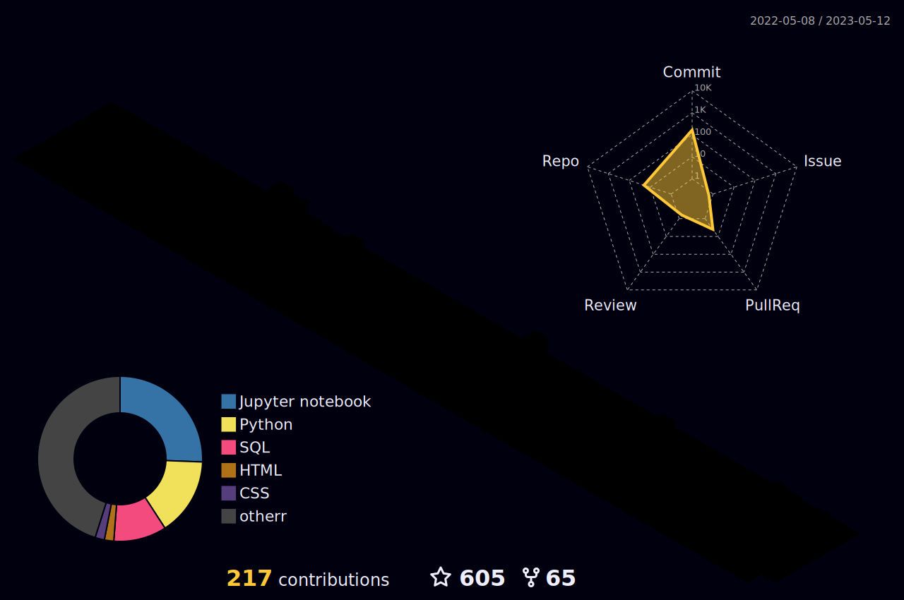

### Hi there 

 Building DE Community 

  
  

 
 

 
 

 

### :man_technologist: Hi, I'm Falcon. I'm experienced in interpreting and analyzing data to drive growth for a banks, finance, retail companies. Furnish insights, analytics, and business intelligence needed to guide decisions
Currently I'm Data Engineeer in Bank. My skills: SQL, Hadoop, Impala, Python, Airflow, SuperSet 

 
<h2>Social Networks</h2>

[![LinkedIn][1.2]][1] [![Telegram][2.2]][2]

[1.2]: https://s4.uupload.ir/files/linkedin_amwn.png
[2.2]: https://s4.uupload.ir/files/telegram_q47u.png

[1]: https://www.linkedin.com/in/artemiy-s-708111210
[2]: https://telegram.me/xxxagtx

 
 

 
<h2>Skills</h2>
<h4>Experienced</h4>

  

<h4>Basics</h4>

  

  
<b>:gear: &nbsp;Git statistics</b>

 
 
  

  
  
 

 
 
 

<!--
**ArtieFalcon/ArtieFalcon** is a ✨ _special_ ✨ repository because its `README.md` (this file) appears on your GitHub profile.

Here are some ideas to get you started:

- 🔭 I’m currently working on ...
- 🌱 I’m currently learning ...
- 👯 I’m looking to collaborate on ...
- 🤔 I’m looking for help with ...
- 💬 Ask me about ...
- 📫 How to reach me: ...
- 😄 Pronouns: ...
- ⚡ Fun fact: ...
-->
